## Welcome

Welcome to Modelling Bot Help, the bot's name is Socio and you can work with it in [Telegram](https://t.me/ModellingBot) and [Twitter](https://twitter.com/ModellingBot). First some tips to work with Socio:

  1. Write correctly: Socio may not understand you well if you make mistakes.
  2. If Socio can't understand some noun you can put it with "" or with determinants.
  3. Usually Socio searchs synonyms and if an element of the model matches with the noun or some synonyms, it performs the actions on that element. In most cases, Socio doesn't do that you want to do for this reason. In these cases, you can use the add command, that doesn't search synonyms.
  4. If Socio didn't understand well some sentences, you can undo the actions and try to say it with other sentence or divided.

## nana

 <iframe width="560" height="315" src="https://www.youtube.com/embed/nTNBQm362KA?ecver=1" frameborder="0" allowfullscreen></iframe>

## How it works on Telegram

In [Telegram](https://t.me/ModellingBot) you can add the bot in a group or talk with it in a single chat. 
Now let's see how you must work with Socio. Telegram's bots work with commands. A command starts with /. You can send only the command and the bot will ask you for the arguments if it is necesary, or you can send the command and arguments together. 

First you must select a Project (_/setproject_) for a chat or make a new project (_/newproject_). Then you can write your sentences to create the model. In case you are in a group, the bot only can read mesages with a command, so you have the talk command (_/talk_) to talk with Socio. 

You also have:

- _/projects_: send you a photo with a list of all projects.  
- _/get_: send you a file with the model in ecore format.
- _/history_: show you a picture with the project history
- _/undo_: undo the last message
- _/redo_: redo the last undo
- _/show_: show you the project state in that moment. 
- _/validate_: validate the model.

## How it works on Twitter

## Examples

Now let's look the sentences you can use and how.

### 1. Add / Create / Make \<Object>

These sentences add new objects to the models. In this case, Socio doesn't search synonyms. 
<table style="width:100%;text-align:center">
<tr>
<th>
Create person.
</th>
<th>
Add work in person.
</th>
<th>
Add numeric age in person.
</th>
</tr>
<tr>
<th>
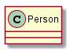
</th>
<th>
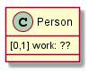
</th>
<th>
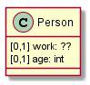
</th>
</tr>
</table>

### 2. Remove / Erase \<Object>

<table style="width:100%;text-align:center">
<tr>
<th>
 Erase numeric age from person.
</th>
<th>
 Remove work from person.
</th>
<th>
 Remove person.
</th>
</tr>
<tr>
<th>

</th>
<th>

</th>
<th>

</th>
</tr>
</table>

### 3. \<Object>  to be \<Object>

<table style="width:100%;text-align:center">
<tr>
<th>
 Packages can be bulky, heavy or fragile.
</th>
<th>
 Students and teachers are persons.
</th>
</tr>
<tr>
<th>
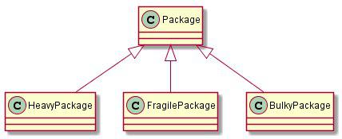
</th>
<th>
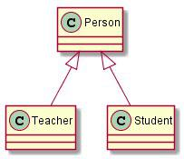
</th>
</tr>
<tr>
<th>
 Name of person is a text. Person's name is a text.
</th>
<th>
 The wife of a man is a woman.
</th>
</tr>
<tr>
<th>
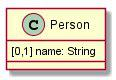
</th>
<th>
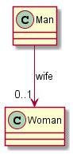
</th>
</tr>
</table>

### 4. \<Object> have / be characterized by / be identified by / be recognized by \<Object>
 
<table style="width:100%;text-align:center">
<tr>
<th>
 Bulky packages are characterized by their width, length and height.
</th>
<th>
 Students have a numeric identifier.
</th>
</tr>
<tr>
<th>
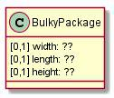
</th>
<th>
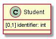
</th>
</tr>
<tr>
<th>
 Medicines have an active ingredient.
</th>
<th>
 Person may has a work
</th>
</tr>
<tr>
<th>
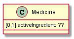
</th>
<th>
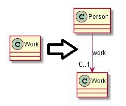
</th>
</tr>
</table>
 
### 5. \<Object> contain / be made of / be made up of / be made from / be composed / include \<Object> 

<table style="width:100%;text-align:center">
<tr>
<th>
 The house is made of rooms.
</th>
<th>
 Students contains a numeric identifier.
</th>
</tr>
<tr>
<th>
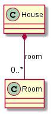
</th>
<th>

</th>
</tr>
</table>

### 6. \<Object> \<verb> \<Object>

<table style="width:100%;text-align:center">
<tr>
<th>
 Carriers can handle deliveries.
</th>
<th>
 The student passed the exams.
</th>
<th>
 The cheque is sent to the bank.
</th>
</tr>
<tr>
<th>
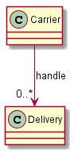
</th>
<th>

</th>
<th>
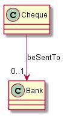
</th>
</tr>
</table>

